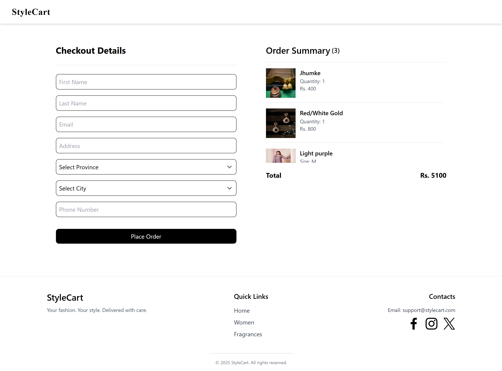

# StyleCart
A modern and responsive product catalog built with React (Vite).  
The platform features category-based browsing, real-time search with suggestions, detailed product pages, and a functional shopping cart with checkout.  
The project focuses on clean UI, optimized performance, and a scalable component-driven architecture.

---

## Features

### **🛍️ Product Browsing**
Explore a collection of products displayed in a clean, responsive grid layout optimized for all screen sizes.

### **📂 Category Filtering**
Filter products by gender and category using dynamic routing and URL query parameters for seamless navigation.

### **🔍 Real-Time Search**
Search products instantly with a keyword-based search system featuring auto-suggestions.

### **📄 Product Details Page**
Each item has a dedicated product page showing images, description, category, and price.

### **🛒 Shopping Cart & Checkout**
Add products to the cart, update quantities, remove items, and proceed to a functional checkout page.

### **⚡ Optimized Performance**
- Compressed images for faster loading  
- Components wrapped in `React.memo` to reduce unnecessary re-renders  
- Efficient state handling for search, filters, and cart  

### **📱 Responsive UI**
Built with TailwindCSS and enhanced with custom CSS for fine-tuned styling.  
Ensures consistent layout across mobile, tablet, and desktop devices.

### **🧩 Modular Component Architecture**
Reusable components including:  
Navbar, Footer, Product Card, Product List, Filters, Cart, Checkout, and Search Bar — ensuring scalability and maintainability.

---

## 🛠 Tech Stack
- **Frontend:** React + Vite  
- **Styling:** TailwindCSS + Custom CSS  
- **Deployment:** Vercel 

---

## 📸 Screenshots

  
  
  

## 🚀 Live Demo
https://style-cart-wheat.vercel.app/
